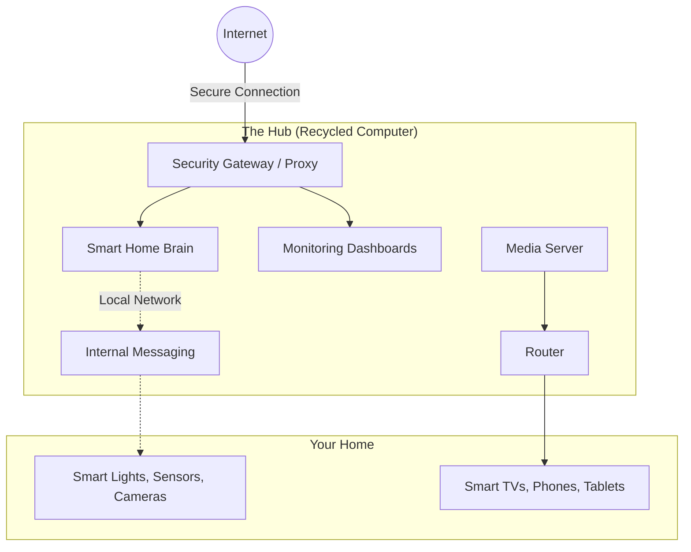

# Home Media Automation

## 🏡 Home Media & Automation Center

Your personal, private, and sustainable smart home hub.


[](LICENSE)

---

**Author:** Nicolas Snider  
**Location:** Mexico

## 📖 Welcome

Welcome to the **Home Media & Automation Center**. This project is all about giving old computers a second life by turning them into a powerful, private, and secure hub for your home.

Instead of relying on expensive cloud subscriptions or buying brand-new equipment, this system lets you manage your smart devices, stream your own media, and keep your data completely private—all running smoothly on recycled hardware.

## ✨ What does it do?

- 🎬 **Your Personal "Netflix":** Organizes and streams your personal movies and TV shows to any screen in your house (powered by Plex).
- 💡 **Smart Home Control:** Connects and automates smart lights, sensors, and cameras in one unified dashboard, without needing external cloud services.
- ♻️ **Eco-Friendly & Sustainable:** Breathes new life into older, retired computers (like Intel Core 2 Duo systems), saving them from the landfill.
- 🔒 **Private & Secure:** Your data stays in your home. The system is designed with strict security measures to ensure everything is locked down and safe from external threats.
- 📊 **Health Monitoring:** Keeps an eye on its own performance, displaying beautiful real-time dashboards of the system's health.

---

## 🛠️ For the Tech-Curious (Under the Hood)

While the system is easy to use, it's built on a robust, professional-grade technology stack. It uses a **containerized architecture** to ensure stability, security, and easy updates.

- **The Brain:** Ubuntu Server / Debian
- **The Engine:** Docker & Docker Compose (keeps everything neatly separated)
- **Home Automation:** Home Assistant & Node-RED
- **Media Streaming:** Plex Media Server
- **Security & Networking:** Nginx (Proxy) & Tailscale (VPN)
- **System Monitoring:** Grafana & Prometheus

### How it connects

At a high level, the system acts as a secure bridge between the internet, your smart devices, and your TVs. It carefully manages what goes in and out, ensuring maximum privacy.



---

## 🚀 Want to try it out?

If you have an old computer lying around and want to set this up yourself, the process is streamlined into automated scripts.

### What you need

- An older computer (Intel Core 2 Duo or better, 4GB RAM)
- A hard drive (SSD recommended for speed)
- A wired internet connection

### Quick Start

1. **Prepare the system:**

   ```bash
   sudo ./scripts/01-system-prep.sh
   ```

2. **Install the engine (Docker):**

   ```bash
   sudo ./scripts/02-install-docker.sh
   ```

3. **Launch the services:**

   ```bash
   ./scripts/03-setup-services.sh
   ```

---

## 🤝 Let's Connect

I built this project to showcase how modern software engineering practices can be applied to everyday problems, creating value while being environmentally conscious.

If you are a recruiter, a potential client, or just a tech enthusiast, I'd love to connect! Feel free to explore the code or reach out.

## 📄 License

This project is licensed under the MIT License - see the [LICENSE](LICENSE) file for details.
