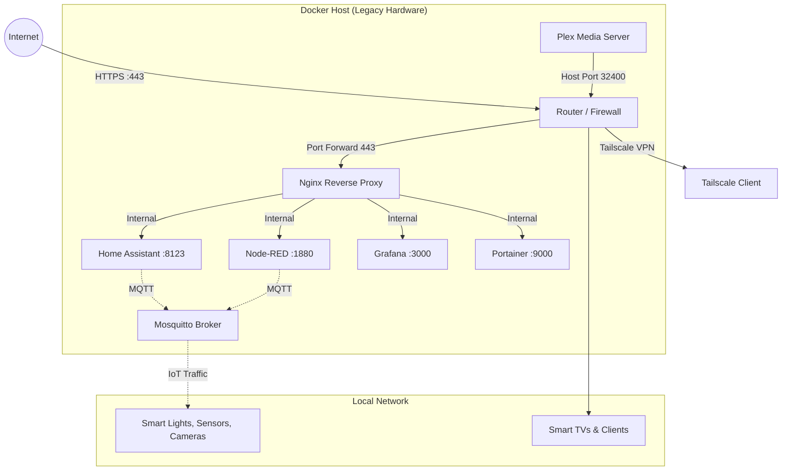

<div align="center">
  <h1>🏡 Home Media & Automation Center</h1>
  <p>A cost-effective, secure, and professional smart home hub built on legacy hardware.</p>

  [](LICENSE)
  []()
  []()
  []()
</div>

---

**Author:** Nicolas Snider  
**Last Updated:** June 16, 2026  
**Location:** Mexico

## 📖 Overview

The **Home Media & Automation Center** project revitalizes legacy hardware (such as Intel Core 2 Duo systems) into a fully functional, highly efficient smart home hub. By utilizing a containerized architecture with Docker and lightweight open-source software, this project delivers a robust environment for media streaming, IoT device management, and advanced home automation without the need for expensive modern hardware.

## ✨ Key Features

- **Hardware Upcycling:** Maximize the lifespan and utility of older processors.
- **Containerized Architecture:** Fully isolated services using Docker and Docker Compose.
- **Media Streaming:** Centralized library management and playback via Plex.
- **Smart Home Automation:** Robust local control of IoT devices using Home Assistant and Node-RED.
- **Secure by Design:** Implementation of least-privilege containers, isolated networks, and reverse proxy routing.
- **Metrics & Monitoring:** Real-time system health tracking with Prometheus and Grafana.

---

## 🛠️ Technology Stack

| Category | Technologies Used |
| :--- | :--- |
| **OS Environment** | Ubuntu Server 22.04 LTS / Debian 12 |
| **Containerization** | Docker, Docker Compose, Portainer |
| **Media Server** | Plex Media Server, Radarr, Sonarr, Prowlarr |
| **Automation** | Home Assistant, Node-RED |
| **Networking & Proxy** | Nginx, Tailscale (VPN) |
| **IoT Messaging** | Eclipse Mosquitto (MQTT) |
| **Monitoring** | Prometheus, Grafana, Node Exporter, Dozzle |

---

## 🌐 Network Architecture

The system utilizes an internal Docker bridge network (`home-network`) to securely route traffic, minimizing host network exposure. External access is securely managed through an Nginx reverse proxy.



---

## 💻 Hardware Requirements

### Minimum Specifications
- **Processor:** Intel Core 2 Duo or equivalent
- **Memory:** 4GB RAM (2GB absolute minimum)
- **Storage:** 500GB HDD (SSD highly recommended for the OS)
- **Network:** Gigabit Ethernet

### Recommended Upgrades
- SSD for OS and Docker volumes to significantly improve I/O performance.
- Upgrading to 8GB RAM to comfortably run Prometheus, Grafana, and media indexers concurrently.

---

## 🔒 Security Best Practices

Security is a primary focus of this architecture. The following guidelines are strictly enforced:

1. **Docker Container Security:**
   - **Least Privilege:** Services run without `privileged: true` unless hardware-level access (like a Zigbee USB dongle) is strictly required.
   - **Network Isolation:** Containers communicate via isolated Docker networks instead of `network_mode: host` whenever possible.
   - **Restricted Socket Access:** Containers requiring Docker daemon access (like Dozzle) are mounted as read-only (`:ro`).
2. **Infrastructure:**
   - Hardened SSH access (Key-based authentication, non-default ports).
   - Local firewall rules (UFW) enforcing strict ingress policies.
   - Credentials injected via `.env` files and standard input streams (e.g., secure MQTT password generation).

---

## 🚀 Getting Started

### 1. System Preparation
Run the preparation script to update the OS, install essential tools, and configure the firewall:
```bash
sudo ./scripts/01-system-prep.sh
```

### 2. Install Docker
Install the Docker engine and configure user group permissions:
```bash
sudo ./scripts/02-install-docker.sh
```

### 3. Deploy Services
Ensure you have created your `.env` file in the `docker` directory. Then, run the deployment script which handles secure MQTT password creation and container startup:
```bash
./scripts/03-setup-services.sh
```

---

## 🤝 Contributing

While this is primarily a personal homelab project, suggestions, optimizations, and issue reports are always welcome.

1. Fork the repository
2. Create a feature branch (`git checkout -b feature/amazing-feature`)
3. Commit your changes (`git commit -m 'Add some amazing feature'`)
4. Push to the branch (`git push origin feature/amazing-feature`)
5. Open a Pull Request

## 📄 License

This project is licensed under the MIT License - see the [LICENSE](LICENSE) file for details.
